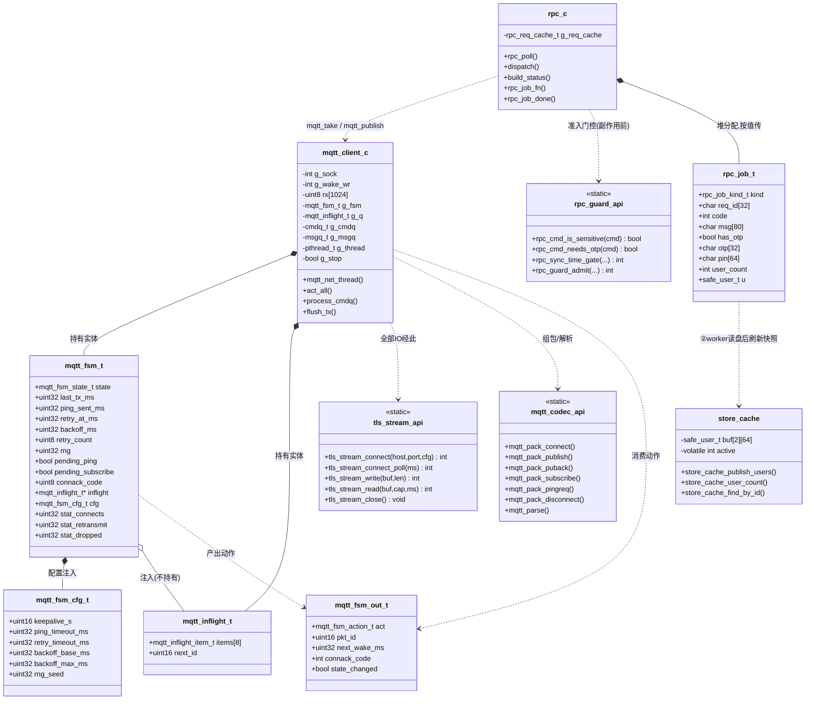
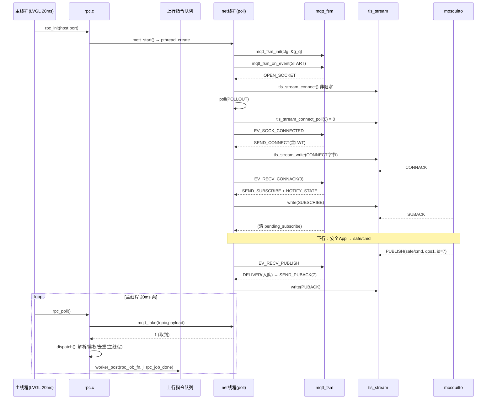
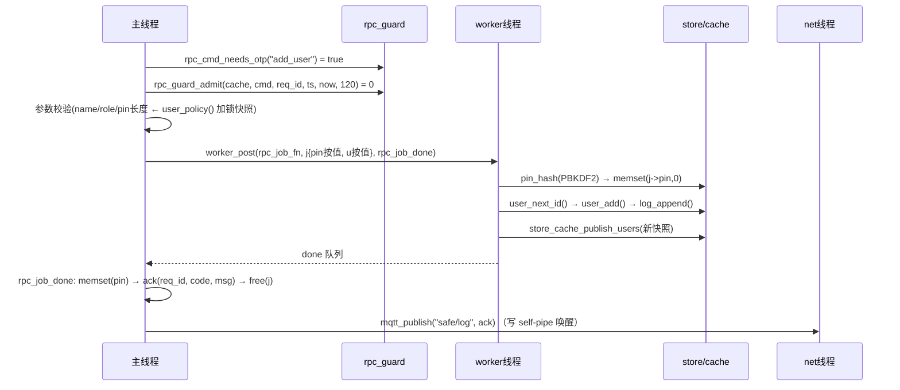
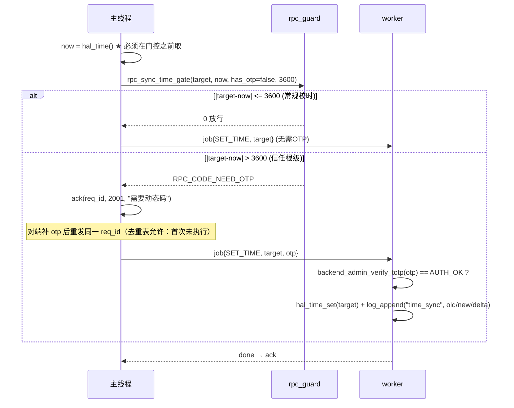
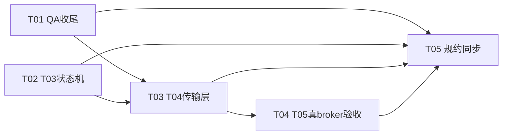

# R9 T03/T04 设计与任务分解 · 2026-09-20

> 作者：架构师（software-architect）
> 基线：`main` @ `2efcfbd`（注：team-lead 给的 `a43904d` 已过时，期间 FM225 五向引导又合了一版），`ctest 15/15` 全绿，工作区干净。
> 规约对齐：《技术路线规约》§3.3 线程表 / §5.10 远程通道 / §5.10.1 R9 模块分解 / §7.5 加密层 / §8 构建；
> 计划来源：《下一步行动计划_2026-09-18.md》§1（R9 主线 T03~T05）与 §2（第二梯队缺陷）。
> 深度档位标注：**【做透】= 命中岗位核心考点 + 有真实需求；【轻量版】= 需求写清、接口预留、实现最小可用；【只写不做】= 需求与取舍写清楚即可。**

---

## 0. 开工前必须知道的三件事（先纠偏，否则会做无用功）

### 0.1 QA-20 / QA-21 / QA-03 **已经修完并入库**，第一步不是从零修

git 历史实锤（不是推测）：

| 缺陷 | 修复 commit | 落地内容 | 现状 |
|---|---|---|---|
| QA-20 第 1/2 步 | `3077ebf` | `store.c` 新增 `g_policy_mutex`；`user_policy()` 改为返回**加锁拷贝快照**（`store.c:926`），消除主线程直读 `g_policy` 的数据竞争 | 已闭环 |
| QA-20 第 2/2 步 | `2bf8f83` | `rpc.c` 的 dispatch 副作用全部下沉 worker（`rpc_job_fn` 三段式：①主线程解析准入 ②worker 落盘 ③主线程回执/UI） | 已闭环 |
| QA-21 | `b0cf864` | `rpc_poll()` 加单拍预算 `RPC_POLL_MAX_MSGS 8` / `RPC_POLL_MAX_MS 8` | **部分**（见 0.2） |
| QA-03 | `a391fb0` | `rpc_cmd_is_sensitive()` 由黑名单改**白名单**（除 `query_status` 外一律敏感）→ `sync_time` 落入敏感档，需鉴权通道 + req_id 去重 | **部分**（见 0.3） |
| QA-20 防回归 | `b1f66f8` | `tools/check_main_thread_store.sh` 挂进 ctest（`check_main_thread_store`） | 已闭环 |

**因此第一步的真实范围是「收尾 + 加固」，不是「修复」。** 工程师若照《QA_缺陷清单_2026-09-17.md》从零做，会与已入库代码冲突。

> 建议 team-lead 同步把《下一步行动计划_2026-09-18.md》§2 表格里 QA-20/21/03 三行标为「已修（剩收尾）」，避免后续再被当成未修项。

### 0.2 QA-21 未根治：预算只限「条数」，不限「单条耗时」

`RPC_POLL_MAX_MS 8` 是**在两条指令之间**检查的，所以：

- 它防的是「一拍被 8 条指令吃满」；
- 它**防不住**单条指令内部耗时 300ms —— 主线程照样卡死一拍。

主线程上残存的两处重活（`grep` 实锤）：

| 位置 | 重活 | 性质 |
|---|---|---|
| `rpc.c:71` `build_status()` → `user_load_all()` | 整份 `users.json` 读盘 + cJSON 全表解析。`query_status` 与 5s 周期上报都走它 | 文件 IO（QA-20 残余 + QA-21） |
| `rpc.c:477` `pin_hash()` | PBKDF2-SHA256，纯 CPU。PC 上几十 ms，**A7 上几百 ms** | CPU 热点 |

`8ms` 预算对这两个都无效。这是「自研 MQTT 提高下行送达率 → 板子上卡死」的直接导火索，必须做透。

### 0.3 QA-03 未闭环：`sync_time` 仍不需动态码、仍免时效、且**完全没有审计日志**

`rpc.c:552-558` 现状：

```c
if (strcmp(c, "sync_time") == 0) {
    int ts = params && cJSON_GetObjectItem(params, "ts") ? ...->valueint : 0;
    if (ts > 0) { hal_time_set((uint32_t)ts); ack(req_id, 0, "ok"); }
    else ack(req_id, 1001, "invalid ts");
    ...
}
```

- 已入敏感档 ⇒ 要求鉴权通道 + req_id 去重（这一步 `a391fb0` 做对了）；
- **但**：不需要管理员动态码；改完不写 `safe.log`；一次调用可把时钟拨到任意点。
- 时钟是 `lock_until` / `valid_until` / TOTP 的**信任根** —— 拨回过去 = 解除锁定 + 复活过期授权。这是「鉴权通道一破，全线崩」的单点。

---

## 1. 第一部分：QA-20 / QA-21 / QA-03 收尾

### 1.1 QA-20：不变式升级为「读写全归 worker」，**不加全局大锁**

**候选方案 A：给 `store` 加一把全局 `pthread_mutex`，读写都锁。**
优点：一行改动消灭 TSan 报告。
否决理由（三条，逐条对应考点）：

1. **锁解决不了 QA-21**：主线程拿锁后仍要自己做「整文件读 + cJSON 解析」，几百毫秒照样卡在 20ms 泵里。锁只是让并发**安全**，没让主线程**变快**。
2. **锁的粒度必须覆盖整个「读-改-写」**：`user_update()` 的实现是 `load_all → 改内存 → save_all`。若只在 `load`/`save` 内部加锁，两次 IO 之间的窗口仍在 → 丢失更新照旧。要正确就必须在**整个 `user_update` 期间**持锁，等价于「把整张表串行化」。
3. **引入锁序问题**：已有 `g_policy_mutex`，再加 `g_store_mutex` 就要定义锁序（`user_policy_set*` 内部既改 policy 又 save users）。两个锁 + 14 处 `user_policy()` 调用点 = 死锁风险面。

**选定方案 B：所有权不变式（ownership），不加新锁。**

> **不变式（写进规约）**：`users.json` 与 `safe.log` 的**全部访问（读 + 写）由 worker 线程独占持有**。
> 主线程与其它线程**不得**调用任何 `store` 读写接口；需要数据走 `worker_post` 三段式，或读「快照缓存」（见 1.1.1）。

为什么这是对的：单核 A7 上「加锁 + 主线程做 IO」只是把延迟从 worker 搬到主线程；所有权不变式**同时**解决 QA-20（无并发）与 QA-21（主线程不做 IO）。这是一次改动吃两个缺陷。

**代价（必须承认）**：

- 主线程拿数据变异步，调用点要改回调式（本次只改 `rpc.c`，面很小）；
- 每次访问要整表拷贝（几十用户 × `safe_user_t` ≈ 200B ≈ 几 KB，20ms 一拍内可忽略）。

**不变式落地检查**：把门禁从「只查写接口」扩到「读写都查」。

```bash
# tools/check_main_thread_store.sh —— 扩展 STORE_WRITE 为 STORE_ACCESS
STORE_ACCESS='(user_add|user_del|user_update|user_policy_set|user_face_set|user_del_cascade|user_face_clear_all'
STORE_ACCESS+='|user_load_all|user_find_by_id|user_find_by_name|user_find_by_face|user_next_id'
STORE_ACCESS+='|user_verify_pin|log_append|log_query)[[:space:]]*\('
```

豁免规则**保持不变**（`*_worker` / `rpc_job_fn` / `user_del_cascade` / 行内 `GATE-EXEMPT` / `auth_fsm.c` 全文件白名单）。

#### 1.1.1 【轻量版】只读快照缓存 `store_cache`

新增理由：`build_status` 只想要 `user_count`，为它投一个 worker 作业有点重；而 UI 侧（page_monitor 等）也需要读。

最小可用设计（**不做全量缓存，只做两个查询**）：

```c
/* app/core/store/store_cache.h —— 新增 */
/* 由 worker 在每次落盘成功后调用（写侧），主线程只读（读侧）。 */
void store_cache_publish_users(const safe_user_t *list, int count);

/* 主线程只读查询：不落盘、不阻塞。count 为缓存里的用户数，stamp 为快照版本号。 */
int  store_cache_user_count(int *count, uint32_t *stamp);
int  store_cache_find_by_id(int id, safe_user_t *out);
```

- 内部用**双缓冲**（两块 `safe_user_t [N]`，写侧填 inactive 块、填完原子切换 `volatile int active`；读侧只取指针后 memcpy 一份）。这是「RCU 的迷你版」，也是本项目能拿来讲的并发素材。
- `N` 取 `SAFE_USER_MAX 64`（静态分配，不 malloc）。
- **【只写不做】**：把 `auth_fsm.c` / `unlock_backend.c` 的主线程 store 调用也收口到快照缓存 —— 与 FSM 状态迁移耦合，本次不动，门禁白名单注释已注明是已知遗留，保持不动。

### 1.2 QA-21：`rpc` 重活下沉 worker，保持三段式语义

沿用 `2bf8f83` 已建立的 `rpc_job_t` 三段式，**只做两处下沉**：

#### (a) `build_status()` 的 `user_load_all()` 下沉（影响 `query_status` 与 5s 状态上报）

```
① 主线程：cJSON 解析 + 鉴权/去重 + 参数校验（不碰 store）
② worker ：user_load_all(&us,&n) → j->user_count = n → user_list_free
           （若 st 未来要更多字段，就在这里把「文件侧字段」全部取齐）
③ 主线程：拼 JSON（含 auth_fsm 状态 / face health 等主线程态）+ mqtt_publish
```

`rpc_job_t` 加字段 `int user_count;`。

**语义变更（必须写明，并在验收里确认）**：`query_status` 的回执从「同拍内立即回」变成「1~N 拍后异步回」。对端靠 `req_id` 关联，不影响可用性；实测延迟 < 50ms。

#### (b) `add_user` 的 `pin_hash()` 下沉

```
① 主线程：读 user_policy()（已是加锁快照，安全）→ 校验 name/role/pin 长度、valid_until 合法性
② worker ：pin_hash() (PBKDF2) → user_next_id() → user_add() → log_append()
③ 主线程：ack + UI
```

`rpc_job_t` 加字段：

```c
char pin[64];   /* ① 按值拷入；② 用完立即 memset 清零；③ free 前再清零一次 */
```

> **安全红线（面试会追问）**：明文 PIN 在 job 里短暂驻留。② 中 `pin_hash` 之后立刻 `memset(j->pin, 0, sizeof(j->pin))`；③ 的 `rpc_job_done` 在 `free(j)` 前再清一次。绝不能只靠 `free`。

#### (c) 保留 `rpc_poll` 预算，但改注释

`RPC_POLL_MAX_MSGS 8` / `RPC_POLL_MAX_MS 8` **保留**，作为「多条累积」的最后兜底；注释改为：

> 单拍预算防的是「多条指令累积吃满一拍」，**不是**单条指令的耗时 —— 单条耗时靠 (a)(b) 的下沉解决。两者不可互相替代。

#### (d) 背压：下行队列满时的取舍

`mqtt_client` 的下行队列（net 线程 → 主线程）容量 16。满时有两个选择：

| 选择 | 后果 |
|---|---|
| 丢最旧 + 仍发 PUBACK | 指令**静默消失**，对端以为成功 → 不可接受 |
| **不入队 + 不发 PUBACK**（选它） | broker 判定 QoS1 未确认 → **重投**（DUP=1）。设备端代价是「处理变慢」，但绝不静默丢指令 |

**红线（规约 §5.10.1 已写明，务必遵守）**：背压**绝不能**靠「停止读 socket」实现 —— 那会关死 TCP 窗口 → 读不到 PINGRESP → keepalive 超时 → 断连 → 重连风暴，背压的收益被它自己制造的重连抵消。

重投报文 DUP=1 到达后，`rpc_guard_admit` 会按 `req_id` 命中去重表回 `1004`（重复请求）。这是对端能看到的**明确信号**，比静默丢弃好。要在验收脚本里断言这个行为。

### 1.3 QA-03：`sync_time` 三层加固

新增两个纯逻辑函数到 `rpc_guard`（保持 rpc_guard「无全局状态、零依赖、可单测」的定位）：

```c
/* 是否需要管理员动态码（TOTP）。白名单式：默认需要，显式列出的才豁免。
 * 当前需 OTP：remote_unlock / add_user / del_user / set_face_enable / set_face_policy / sync_time */
bool rpc_cmd_needs_otp(const char *cmd);

/* sync_time 跳变门控。
 *   now       本机当前 Unix 秒
 *   target    请求要设的目标 Unix 秒
 *   has_otp   本次请求是否带了（且已通过校验的）管理员动态码
 *   max_jump  允许的「无需 OTP 的最大跳变秒数」（建议 3600）
 * 返回 0 = 放行；否则返回应回的错误码（RPC_CODE_NEED_OTP / RPC_CODE_BAD_PARAM）。
 *
 * 语义：|target - now| <= max_jump  —— 视为常规校时（NTP / RTC 漂移补偿），
 *       只需「鉴权通道 + req_id 去重」即可（这两条 a391fb0 已保证）；
 *       |target - now| >  max_jump  —— 视为信任根级操作，**必须**带有效管理员动态码。 */
int rpc_sync_time_gate(int64_t target, int64_t now, bool has_otp, int64_t max_jump);
```

`#define RPC_CLOCK_JUMP_FREE_SEC 3600`（1 小时）。

**三层防御与档位**：

| 层 | 内容 | 档位 |
|---|---|---|
| 1 | 敏感档门控（鉴权通道 + req_id 去重 + 白名单分级） | 已有（`a391fb0`），保持 |
| 2 | **跳变幅度门控**：>1h 需管理员 OTP；≤1h 常规校时放行 | 【做透】 |
| 3 | **审计日志**：每次 `sync_time` 在 worker 段 `log_append("time_sync", "remote", 1, "old=.. new=.. delta=..")`。当前完全没有日志 —— 安全设备改信任根不留痕是硬伤 | 【做透】 |
| 4 | 单调时钟锚点限频（两次校时间隔 <60s 拒绝；掉电持久化的锚点） | 【只写不做】—— 掉电保持的锚点要占一个文件/字段，超出本期 |

**诚实边界（必须写进文档，面试时主动说）**：

- 幅度门控依赖 `hal_time()` 的当前值。若攻击者已成功拨过一次时钟，`now` 就不可信 → 门控只能限制「逐步漂移」，不能阻止「一次性拨到底后为所欲为」。
- 它是**深度防御**，不是根治。根治路径是 §7.5 的双向 TLS（R9 T06）+ broker ACL：让攻击者根本拿不到「可发指令的通道」。
- 这个取舍要能讲清：**为什么选了一个不完美的方案** —— 因为它在 T06 之前就能把「匿名/低权限改时钟」这条最粗的口子堵上，成本 30 行代码。

**`sync_time` 的 OTP 校验顺序（重要，避免与 TOTP 的鸡生蛋问题冲突）**：

1. 先取 `now = hal_time()`（**在门控判定之前取**，不要用校时后的值）；
2. `rpc_sync_time_gate(target, now, /*has_otp=*/false, ...)`：若判定「需 OTP」，则**先**走 worker 校验 OTP（`backend_admin_verify_totp`），校验通过后再在 worker 段执行 `hal_time_set` + `log_append`。
3. 若判定「无需 OTP」（≤1h），直接走 worker 段执行。

即：**OTP 校验与校时都在 ② worker 段串行执行**，① 主线程只做门控判定与回执参数准备。这样天然避免了「校验通过后时钟又被改」的 TOCTOU。

---

## 2. 第二部分：R9 T03 —— 状态机核心 `mqtt_fsm.[ch]`【做透】

### 2.1 定位（这是整个 R9 的价值所在）

**不建 socket、不起线程、不调 `hal_time_ms()`、不 malloc、不打印。** 时间全部由参数注入。
这条切分是 R9 最重要的一次决定：否则「状态机单独出单元测试」只能靠真 broker 碰运气。

### 2.2 状态集（5 个，刻意不做「已订阅」态）

```c
typedef enum {
    MQTT_ST_IDLE = 0,       /* 未启动 / 已停止 */
    MQTT_ST_CONNECTING,     /* socket 已发起（非阻塞 connect 进行中），尚未收到 CONNACK */
    MQTT_ST_CONNECTED,      /* 已收 CONNACK(0)，可收发 */
    MQTT_ST_WAIT_RETRY,     /* 连接失败 / 链路断开，等退避到期后重连 */
    MQTT_ST_DISCONNECTING,  /* 已发 DISCONNECT（优雅停止），等 socket 关闭 */
} mqtt_fsm_state_t;
```

**为什么不把「已订阅」做成独立状态**：
MQTT 3.1.1 允许 SUBSCRIBE 后立刻 PUBLISH，且 broker 不会在 SUBACK 之前推下行。把「订阅已确认」做成状态会让状态机多两个迁移、多两种失败路径，收益为零。改用 `bool pending_subscribe` 标志表达「CONNACK 后需要发 SUBSCRIBE」——**clean_session=1 时重连必须重发**，这个标志就是它的载体。

### 2.3 事件集

```c
typedef enum {
    MQTT_EV_START,           /* 上层要求启动            */
    MQTT_EV_STOP,            /* 上层要求停止            */
    MQTT_EV_SOCK_CONNECTED,  /* 非阻塞 connect 完成且成功 */
    MQTT_EV_SOCK_FAILED,     /* connect 失败            */
    MQTT_EV_IO_ERROR,        /* 读/写失败 或 对端 EOF   */
    MQTT_EV_RECV_CONNACK,    /* arg: mqtt_connack_t     */
    MQTT_EV_RECV_SUBACK,     /* arg: mqtt_suback_t      */
    MQTT_EV_RECV_PUBLISH,    /* arg: mqtt_publish_rx_t  */
    MQTT_EV_RECV_PUBACK,     /* arg: uint16_t pkt_id    */
    MQTT_EV_RECV_PINGRESP,   /* 无 arg                  */
    MQTT_EV_TX_FLUSHED,      /* 一次下发完成（可更新 last_tx_ms） */
} mqtt_fsm_ev_t;
```

### 2.4 数据结构

```c
/* 配置：init 时注入，运行期不变（便于单测固定） */
typedef struct {
    uint16_t keepalive_s;        /* MQTT keepalive，建议 20 */
    uint32_t ping_timeout_ms;    /* PINGREQ 后等 PINGRESP 的超时，建议 keepalive*1000 */
    uint32_t retry_timeout_ms;   /* QoS1 未确认重传超时，建议 5000 */
    uint32_t backoff_base_ms;    /* 退避基数，建议 500   */
    uint32_t backoff_max_ms;     /* 退避封顶，建议 30000 */
    uint32_t rng_seed;           /* 抖动 PRNG 种子（单测固定 → 结果确定） */
} mqtt_fsm_cfg_t;

typedef struct {
    mqtt_fsm_state_t state;
    /* ---- 定时器 ---- */
    uint32_t last_tx_ms;     /* 最后一次**发送**报文的时刻（keepalive 判据） */
    uint32_t ping_sent_ms;   /* PINGREQ 发出时刻；0 = 未发 */
    uint32_t retry_at_ms;    /* WAIT_RETRY 的到期时刻 */
    /* ---- 退避 ---- */
    uint32_t backoff_ms;     /* 当前退避时长 */
    uint8_t  retry_count;    /* 连续失败次数 */
    uint32_t rng;            /* xorshift32 私有状态（★ 不用 rand()） */
    /* ---- 标志 ---- */
    bool     pending_ping;
    bool     pending_subscribe;
    bool     session_present;
    uint8_t  connack_code;
    /* ---- 关联（不持有，由 T04 注入实体） ---- */
    mqtt_inflight_t * inflight;  /* T02 的未确认队列；可为 NULL（QoS0 场景） */
    /* ---- 统计（供 mqtt_stats() 与单测断言） ---- */
    uint32_t stat_connects, stat_reconnects, stat_ping_timeout,
             stat_retransmit, stat_dropped, stat_rx_publish;
    mqtt_fsm_cfg_t cfg;
} mqtt_fsm_t;
```

### 2.5 输出：状态机「说」要做什么，不自己做 IO

```c
typedef enum {
    MQTT_ACT_NONE = 0,
    MQTT_ACT_OPEN_SOCKET,      /* 要求传输层发起非阻塞连接      */
    MQTT_ACT_CLOSE_SOCKET,
    MQTT_ACT_SEND_CONNECT,     /* 含 LWT                        */
    MQTT_ACT_SEND_SUBSCRIBE,
    MQTT_ACT_SEND_PINGREQ,
    MQTT_ACT_SEND_DISCONNECT,
    MQTT_ACT_SEND_PUBLISH,     /* 新发；pkt_id 已由 inflight 分配 */
    MQTT_ACT_SEND_PUBACK,      /* 下行 QoS1 确认；pkt_id         */
    MQTT_ACT_RETRANSMIT,       /* 重传；pkt_id                   */
    MQTT_ACT_DROP_INFLIGHT,    /* 重传次数用尽，丢弃并记 stat    */
    MQTT_ACT_DELIVER,          /* 下行消息入队（交 rpc 层）      */
    MQTT_ACT_NOTIFY_STATE,     /* 连接状态变化，通知上层/UI      */
} mqtt_fsm_action_t;

typedef struct {
    mqtt_fsm_action_t act;
    uint16_t pkt_id;
    uint32_t next_wake_ms;     /* 建议的下次唤醒间隔（poll 超时上界） */
    int      connack_code;     /* NOTIFY_STATE 时有效 */
    bool     state_changed;
} mqtt_fsm_out_t;
```

> **为什么用「输出动作」而不是回调**：回调会把 IO 语义绑进纯逻辑层，单测就得造 socket。
> 输出动作让单测只需断言「喂这些字节 + 这些时间 → 期望这些动作」，这才是「确定性单测」的根本。

### 2.6 接口签名

```c
void mqtt_fsm_init(mqtt_fsm_t *f, const mqtt_fsm_cfg_t *cfg, mqtt_inflight_t *q);

/* 时间推进（每拍/每次 poll 返回都调）。now_ms 由调用方注入。
 * 同一拍可能产出多个动作：调用方需 while (out.act != MQTT_ACT_NONE) 循环消费。
 * ★ 本函数内部会推进定时器并可能直接完成状态迁移（如 ping 超时 → WAIT_RETRY）。 */
void mqtt_fsm_tick(mqtt_fsm_t *f, uint32_t now_ms, mqtt_fsm_out_t *out);

/* 事件驱动。arg 按事件类型强转；无 arg 的事件传 NULL。 */
void mqtt_fsm_on_event(mqtt_fsm_t *f, mqtt_fsm_ev_t ev, const void *arg,
                       uint32_t now_ms, mqtt_fsm_out_t *out);

/* 收包统一入口（内部按 type 分派到对应 EV_*） */
int  mqtt_fsm_on_packet(mqtt_fsm_t *f, const mqtt_pkt_view_t *v,
                        uint32_t now_ms, mqtt_fsm_out_t *out);

/* 轮询：距离下一个定时器到期还有多少 ms（供 poll 超时用）。返回 0 表示「现在就该动」。 */
uint32_t mqtt_fsm_next_wake_ms(const mqtt_fsm_t *f, uint32_t now_ms);

/* 请求发送一条 QoS1 上行：分配 pkt_id + 入 inflight，返回 pkt_id（0 = 失败）。
 * pkt/len 为**已组好**的字节（由 mqtt_pack_publish 产出）。 */
uint16_t mqtt_fsm_publish_begin(mqtt_fsm_t *f, const uint8_t *pkt, size_t len,
                                uint32_t now_ms, mqtt_fsm_out_t *out);

const char * mqtt_fsm_state_name(mqtt_fsm_state_t s);
const char * mqtt_fsm_action_name(mqtt_fsm_action_t a);
```

### 2.7 定时器语义（逐个钉死，这是最容易写错的地方）

| 定时器 | 判据 | 到期动作 | 规范依据 |
|---|---|---|---|
| **keepalive** | `now - last_tx_ms >= keepalive_s * 1000`（**只记发送**，收到 broker 报文**不**刷新 —— 规范约束的是本端发送间隔） | 发 PINGREQ，置 `pending_ping`，记 `ping_sent_ms` | §3.1.2.10 |
| **PING 超时** | `pending_ping && now - ping_sent_ms >= ping_timeout_ms` | 判定**半开连接** → CLOSE_SOCKET → 进 `WAIT_RETRY` | 实践判据 |
| **QoS1 重传** | `mqtt_inflight_timeout_scan(q, now, retry_timeout_ms)` 命中 | `RETRANSMIT`（DUP 由 T02 置位）+ `stat_retransmit++`；`mark_sent` 返回 `MALFORMED`（次数用尽）→ `DROP_INFLIGHT` | §3.3.1 |
| **重连退避** | `state == WAIT_RETRY && now >= retry_at_ms` | `retry_at_ms = 0` → `OPEN_SOCKET`；`backoff_ms = min(max, base << min(retry_count,5))`，**加抖动** | — |
| **退避抖动** | `delay = backoff*3/4 + (xorshift32() % (backoff/4 + 1))` → `delay ∈ [0.75b, b]` | 见下 | — |

**为什么抖动的 PRNG 用自己的 xorshift32 而不是 `rand()`**：
`rand()` 是进程全局状态、`rand_r()`/`rand()` 在 glibc 下带内部锁，且不同 libc 实现不同 → 单测结果不可确定、不可移植。自己写一个 12 行的 xorshift32，种子从 `cfg.rng_seed` 注入，单测就能断言**精确的重连时刻序列**。这是「可测性驱动实现选择」的典型例子。

**退避封顶为什么从 Paho 的 8s 改成 30s**：
broker 重启场景下 8s 封顶会在 30s 内产生 ~6 次注定失败的重连（每次都要走 DNS/TCP/CONNECT），对单核 A7 是纯浪费。30s 封顶的代价是「故障恢复感知慢」，但设备端有 LWT + 5s 状态快照兜底，可接受。

**`CONNACK` 返回码 ≠ 0 的处理（重要取舍）**：
协议性拒绝（如 `0x05 未授权`）**不进退避重连** —— 重连只会得到同一个拒绝码，白白打 broker。改为 `NOTIFY_STATE`（带 `connack_code`）后停在 `IDLE`，由上层决定（记日志 / 提示凭据错误）。只有**传输层**失败才退避重连。这是「区分错误类型」的考点。

**重连后必须清空 inflight**：
`clean_session=1` 时会话不保留，重连后旧 pkt_id 无意义 → `mqtt_inflight_init(q)`。代价：**上行事件在重连窗口内会丢**，与规约 §5.10.1 的契约边界一致（「上行的权威记录是本地 `safe.log`，不是 MQTT 通道」）。

### 2.8 状态迁移表

| 当前 | 事件 | 迁移后 | 输出动作 |
|---|---|---|---|
| IDLE | START | CONNECTING | OPEN_SOCKET |
| CONNECTING | SOCK_CONNECTED | CONNECTING | SEND_CONNECT（含 LWT） |
| CONNECTING | SOCK_FAILED | WAIT_RETRY | （算退避，置 retry_at_ms） |
| CONNECTING | RECV_CONNACK(0) | CONNECTED | SEND_SUBSCRIBE（若 pending_subscribe）+ NOTIFY_STATE |
| CONNECTING | RECV_CONNACK(≠0) | IDLE | NOTIFY_STATE(connack_code)，**不退避** |
| CONNECTED | tick: keepalive 到期 | CONNECTED | SEND_PINGREQ |
| CONNECTED | RECV_PINGRESP | CONNECTED | （清 pending_ping） |
| CONNECTED | tick: ping 超时 | WAIT_RETRY | CLOSE_SOCKET + 算退避 |
| CONNECTED | IO_ERROR | WAIT_RETRY | CLOSE_SOCKET + 算退避 |
| CONNECTED | RECV_PUBLISH(qos1) | CONNECTED | DELIVER → 入队成功才 SEND_PUBACK |
| CONNECTED | RECV_PUBACK | CONNECTED | （inflight_ack） |
| CONNECTED | tick: inflight 超时 | CONNECTED | RETRANSMIT / DROP_INFLIGHT |
| CONNECTED | STOP | DISCONNECTING | SEND_DISCONNECT |
| WAIT_RETRY | tick: 退避到期 | CONNECTING | OPEN_SOCKET |
| WAIT_RETRY | STOP | IDLE | （取消定时器） |
| DISCONNECTING | STOP / IO_ERROR | IDLE | CLOSE_SOCKET |

### 2.9 单测要点（`tests/test_mqtt_fsm.c`）

必须覆盖（每条都是能被确定性断言的）：

1. 启动序列：IDLE→START→`OPEN_SOCKET`→SOCK_CONNECTED→`SEND_CONNECT`。
2. CONNACK(0) → CONNECTED + `SEND_SUBSCRIBE` + NOTIFY_STATE。
3. CONNACK(5) → IDLE + NOTIFY_STATE(5)，且**不产生** OPEN_SOCKET（不重连）。
4. keepalive：注入 `now = last_tx + keepalive*1000` → `SEND_PINGREQ`；不注入 PINGRESP → 再推进 `ping_timeout_ms` → `CLOSE_SOCKET` + WAIT_RETRY + `stat_ping_timeout == 1`。
5. 退避序列：连续失败 8 次，断言 `retry_at_ms` 序列落在 `[0.75b, b]` 区间且封顶 30s（用固定 `rng_seed` 断言**精确值**）。
6. 重传：入队一条 inflight → 推进 `retry_timeout_ms` → `RETRANSMIT`；`mark_sent` 3 次后 → `DROP_INFLIGHT` + `stat_dropped == 1`。
7. 重连后 `mqtt_inflight_count(q) == 0`。
8. 半包：`mqtt_fsm_on_packet` 收到不完整字节（由 T04 保证不调用）→ 本层不处理；由 T04 在 `mqtt_parse` 返回 `TRUNCATED` 时继续收。
9. NULL / 非法入参不崩。

---

## 3. 第三部分：R9 T04 —— 传输层抽象 + 线程接入【做透】

### 3.1 `tls_stream`：保持规约 §7.5 的 4 函数，**新增第 5 个**

规约 §7.5 已定稿：

```c
int  tls_stream_connect(const char *host, int port, const tls_conf_t *cfg);
int  tls_stream_write(const uint8_t *buf, size_t len);
int  tls_stream_read(uint8_t *buf, size_t cap, int timeout_ms);
void tls_stream_close(void);
```

**决策：签名不动**（先改规约再动码是纪律；§7.5 已定稿，改签名成本 > 收益）。
**但必须新增一个函数**，否则非阻塞 connect 无法实现：

```c
/* 查询非阻塞 connect 的进度。返回：0 = 已完成且成功；1 = 仍在进行中；<0 = 失败。
 * 必须在 tls_stream_connect() 返回有效 fd 之后、由外层 poll(POLLOUT) 就绪时调用。 */
int tls_stream_connect_poll(int timeout_ms);
```

> **这是对规约 §7.5 的扩展，需同步修订该节。**
> 未来 T06（mbedTLS）还应把整套签名扩展为句柄式 `tls_stream_t *`（4 函数无句柄 → mbedTLS 的 `ssl_context` 只能放全局单例，且握手期状态机无法表达）。本次**不改**，只在文档标注「T06 前须修订」。

**`tls_stream_read` 的语义必须现在钉死（否则 T06 必踩坑）**：

> 恒等后端（后端 A）的 `tls_stream_read` 必须是**非阻塞**的，且外层已经用 `poll()` 确认 `POLLIN` 就绪后才调用 —— `timeout_ms` 恒传 `0`。
> 若让 `read` 内部自己 `poll`/阻塞等待，就会与 net 线程的外层 `poll()` 形成**双重等待**：外层超时与内层超时互相打架，keepalive 定时器会被内层吞掉。
> 这条语义同样约束后端 B：mbedTLS 的 `WANT_READ/WANT_WRITE` 必须由**外层**决定事件掩码，`tls_stream` 只做「有数据就解出明文，没有就返回 WANT_*」。

### 3.2 第 4 条线程的必要性论证（规约 §3.3 要求：新增线程必须说明为何不能收敛）

| 收进去？ | 为什么不成立 |
|---|---|
| **worker 线程** | worker 是「作业队列 + 阻塞执行」模型，线程阻塞在 `pthread_cond_wait` 等作业，**没有 poll 循环**。塞 MQTT 进去要在 worker 里加 poll + 定时器管理，让它从「纯作业执行者」变成「IO 复用 + 作业」混合体；更致命的是：一个跑 500ms 的落盘作业会让 MQTT 的 PING 超时**误判**（定时器没法按时推进）。 |
| **face 线程** | face 的 poll 是**取帧实时性**敏感（预览 fps），相机 fd + FM225 串口 fd 已占满它的节拍。MQTT 的 TLS 握手（T06）是长阻塞计算 → 直接把预览冻住。且 face 属 hal 层、MQTT 属 core/remote，混进去破坏分层。 |
| **主线程** | 主线程是 LVGL 的 20ms 节拍。重连退避最长 30s、T06 的 mbedTLS 握手是阻塞式 —— 主线程扛不住，且违反「LVGL 非线程安全，UI 只在主线程」的反面（网络 IO 不该占主线程）。 |

→ **第 4 条线程是必要的**，正好用满 §3.3 的「应用自建 ≤4」预算（main + worker + face + mqtt）。
**代价**：单核 A7 上 4 条常驻线程 → 上下文切换增加。
**缓解**：MQTT 线程 99% 时间阻塞在 `poll()`，CPU 占用接近 0；且它替掉了 Paho 的 **2 条**第三方线程，进程内线程数是**净减少**。

### 3.3 poll 循环骨架（`mqtt_client.c`）

```c
static void * mqtt_net_thread(void *arg)
{
    uint8_t rx[MQTT_RX_CAP];          /* 1024，线性 + memmove */
    size_t  rx_len = 0;

    for (;;) {
        if (g_stop) break;
        uint32_t now = hal_time_ms();

        /* 1) 排空 self-pipe（唤醒字节无语义，只用来打断 poll） */
        drain_wake_fd();

        /* 2) 消费上行指令队列（publish / set_will / stop），持锁但不做 socket IO */
        process_cmdq(&fsm, now);      /* 内部：mqtt_fsm_publish_begin + 组包 + 入 inflight */

        /* 3) 驱动状态机：tick + 把产生的动作全部执行掉 */
        mqtt_fsm_out_t out;
        mqtt_fsm_tick(&fsm, now, &out);
        act_all(&out, now);           /* while (out.act != NONE) { 执行; 再取; } */

        /* 4) 计算 poll 超时 = min(keepalive / ping / 重传 / 退避 / 有指令则 0) */
        int timeout = (int)mqtt_fsm_next_wake_ms(&fsm, now);
        if (cmdq_nonempty_unsafe_hint()) timeout = 0;   /* 有指令就不等 */

        /* 5) poll 双 fd：socket + self-pipe */
        struct pollfd fds[2];
        fds[0].fd = g_sock;      fds[0].events = want_events(&fsm);   /* POLLIN 恒要；有待写则加 POLLOUT */
        fds[1].fd = g_wake_rd;   fds[1].events = POLLIN;
        int n = poll(fds, 2, timeout);
        if (n < 0) { if (errno == EINTR) continue; /* 其它错误 → IO_ERROR */ }

        /* --- 非阻塞 connect 进行中 --- */
        if (connecting && (fds[0].revents & POLLOUT)) {
            int r = tls_stream_connect_poll(0);
            if (r == 0)      { mqtt_fsm_on_event(&fsm, MQTT_EV_SOCK_CONNECTED, NULL, now, &out); act_all(&out, now); }
            else if (r < 0)  { mqtt_fsm_on_event(&fsm, MQTT_EV_SOCK_FAILED,    NULL, now, &out); act_all(&out, now); }
        }

        /* --- 可读：尽量读满，循环解析（粘包） --- */
        if (fds[0].revents & (POLLIN | POLLHUP | POLLERR)) {
            ssize_t m = tls_stream_read(rx + rx_len, sizeof(rx) - rx_len, 0);
            if (m == 0) { /* EOF → IO_ERROR → 关 + 退避 */ }
            else if (m > 0) {
                rx_len += (size_t)m;
                size_t off = 0;
                for (;;) {
                    mqtt_pkt_view_t v; size_t consumed = 0;
                    int pr = mqtt_parse(rx + off, rx_len - off, &v, &consumed);
                    if (pr == MQTT_ERR_TRUNCATED) break;              /* 半包：继续收 */
                    if (pr != MQTT_OK) { /* 协议错：不可自愈 → 关 + 退避 */ break; }
                    mqtt_fsm_on_packet(&fsm, &v, now, &out);
                    act_all(&out, now);
                    off += consumed;
                }
                if (off) { memmove(rx, rx + off, rx_len - off); rx_len -= off; }
            }
        }

        /* --- 可写：flush 待发缓冲 --- */
        if (fds[0].revents & POLLOUT) flush_tx(&fsm, now);
    }
    return NULL;
}
```

**半包/粘包：线性缓冲 + memmove，不用环形缓冲。**
理由：MQTT 报文可能跨缓冲尾部，环形缓冲处理「半包」要维护两套游标，状态复杂度翻倍；1024B 线性 + `memmove` 在「每秒几包」的频率下成本可忽略（几 KB 的 memmove ≈ 微秒级）。
**这是「为什么没选另一个」的现成素材**：环形缓冲适合**字节流**高频场景（UART 115200bps 持续灌入），MQTT 这里是**报文流**低频场景，线性更对路。

### 3.4 self-pipe 唤醒

```c
int p[2]; pipe(p);                  /* 或 pipe2(..., O_NONBLOCK) */
fcntl(p[0], F_SETFL, O_NONBLOCK);
fcntl(p[1], F_SETFL, O_NONBLOCK);
/* 写端 p[1]：任何线程调 mqtt_publish() 后 write(p[1], "", 1) 唤醒 net 线程
 * 读端 p[0]：进 poll 的 fds[1] */
```

- **为什么用 self-pipe 而不是 condvar**：线程要**同时**等「socket IO」和「上层指令」，condvar 无法与 fd 一起等待。self-pipe 是 Unix 下把任意事件统一进 `poll()` 的标准手段 —— 这正是 IO 复用考点的加分项。
- **为什么用 pipe 而不是 eventfd**：`eventfd` 是 Linux 专有；本项目要保 PC(SDL) / 板子(FBDEV) 双构建与未来可移植性，pipe 更稳。代价：多 2 个 fd。

### 3.5 消息队列（两类，都定长静态）

| 队列 | 方向 | 容量 | 满时策略 |
|---|---|---|---|
| 上行指令 | 主线程 → net 线程 | 16 × (topic 64 + payload 512) | 丢最旧 + `stat_queue_full++`（上行是事件/回执，可丢；权威记录在 `safe.log`） |
| 下行消息 | net 线程 → 主线程（`mqtt_take` 消费） | 16 × (topic 128 + payload 512) | **不入队 + 不发 PUBACK** → broker 重投（见 §1.2(d)） |

- **静态定长环形数组，不 malloc**：网线程里 malloc 有失败与碎片风险，且设备端长时间运行的内存确定性比灵活性重要。
- 两条都是 SPSC（单生产者单消费者），用一把 mutex 简化即可；**硬约束：持锁期间不得做 socket IO / 不得调回调**（遵守规约「不持锁调回调」）。

### 3.6 对外契约：现有签名**全部保留**，只新增

`rpc.c` / `ui.c` / `page_settings.c` **零改动**（`grep` 确认外部只用 `mqtt_is_connected()`）。

保持：`mqtt_start` / `mqtt_stop` / `mqtt_publish` / `mqtt_is_connected` / `mqtt_set_credentials` / `mqtt_credentials_configured` / `mqtt_is_authenticated` / `mqtt_take`。

新增（规约 §5.10.1 已预留）：

```c
void mqtt_set_will(const char *topic, const char *payload, int qos, bool retain);
const char * mqtt_state_str(void);                 /* "idle"/"connecting"/"connected"/"retry" */
void mqtt_stats(uint32_t *connects, uint32_t *reconnects, uint32_t *dropped, uint32_t *queue_full);
size_t mqtt_queued(void);                          /* 下行队列积压条数（供背压诊断） */
```

- `mqtt_stub.c` 必须同步实现这些函数（否则板子构建链接失败 —— 本项目踩过「stub 与真实现签名不一致」的坑）。
- **`mqtt_stop` 顺带修掉 QA-04**：Paho 版没有停止标志（`QA-04`），自研版必须置 `g_stop` + 写 self-pipe + `pthread_join`。

**`mqtt_stop` 的 join 超时（最容易漏的点）**：
net 线程可能在等 PUBACK（inflight 非空），join 会卡住。设计：

```c
void mqtt_stop(void)
{
    g_stop = true;
    wake();                                  /* 写 self-pipe 唤醒 poll */
    /* 最多等 MQTT_STOP_JOIN_MS（建议 1000ms）：超时则放弃 join，不 pthread_cancel
     * —— cancel 会让线程停在半写状态（socket 缓冲区里半个报文），得不偿失。 */
    join_with_timeout(MQTT_STOP_JOIN_MS);
    tls_stream_close();
}
```

### 3.7 LWT（遗嘱）

`mqtt_pack_connect()`（T01）已支持 `will_topic` / `will_msg`。T04 在 `MQTT_ACT_SEND_CONNECT` 时填：

- topic：`safe/status`
- payload：`{"online":0,"ts":<now>,"fw":"<SAFE_VERSION_STRING>"}`
- qos：1，retain：**true**

**验收时最容易误判的一点（写进判据）**：优雅退出（`mqtt_stop` 发 DISCONNECT）时 **broker 不发 LWT**。只有异常断开（TCP RST / `kill -9` / keepalive 超时）才发。验收脚本必须先确认这一点，否则会误判「LWT 没生效」。

### 3.8 QoS1 上行：超过 512B 的降级策略（必须实现，不能丢）

`MQTT_INFLIGHT_PKT_MAX = 512`（T02 已定）。若一条待发报文 > 512B（如 `safe/log` 的 detail 很长）：

- ❌ 不能丢弃（安全事件丢不起）；
- ✅ **降级为 QoS0 直发**，不进 inflight，`stat_dropped` **不**计数（改用 `stat_qos0_fallback++`），并打一行日志。

这是「固定缓冲 vs 变长需求」的经典取舍，实现只需 5 行但**必须显式写**，否则会变成静默丢包。

### 3.9 CMake：砍掉 Paho 依赖（R9 最大的实际收益）

现状（`app/core/CMakeLists.txt:30`）：

```cmake
if(SAFE_HAVE_PAHO AND SAFE_HAVE_CJSON)
    list(APPEND SAFE_CORE_SRC remote/mqtt_client.c remote/rpc.c)
else()
    list(APPEND SAFE_CORE_SRC remote/mqtt_stub.c remote/rpc_stub.c)
endif()
```

→ 板子无 ARM 版 Paho ⇒ 编 stub ⇒ **板上远程通道永久断线**。

改为：

```cmake
if(SAFE_HAVE_CJSON)
    list(APPEND SAFE_CORE_SRC remote/mqtt_client.c remote/rpc.c
                              remote/mqtt_fsm.c remote/tls_stream.c)
else()
    list(APPEND SAFE_CORE_SRC remote/mqtt_stub.c remote/rpc_stub.c)
endif()
```

`cmake/SafeFeatures.cmake`：删掉 Paho 探测（或保留变量但不再作为 MQTT 的开关条件）；`SAFE_DEP_INCLUDE_DIRS` 不再追加 Paho；`SAFE_EXTRA_LIBS` 不再链 `paho-mqtt3a`。

> **这是 R9 真正的业务价值**：自研不是为了「造轮子」，是因为**板子上根本没有可用的轮子**。面试要能一句话讲清这个因果。

---

## 4. 文件清单

### 新增

| 路径 | 说明 |
|---|---|
| `app/core/remote/mqtt_fsm.h` / `mqtt_fsm.c` | T03 状态机核心（纯逻辑，时间注入） |
| `app/core/remote/tls_stream.h` / `tls_stream.c` | T04 传输抽象；本次只落地**后端 A 恒等**，后端 B 留 `#if SAFE_FEATURE_TLS` 桩 |
| `app/core/store/store_cache.h` / `store_cache.c` | 【轻量版】只读快照缓存（双缓冲，主线程读 / worker 写） |
| `tests/test_mqtt_fsm.c` | T03 单测 |
| `tools/mqtt_e2e_check.sh` | T05 真 broker 端到端验收脚本（不进默认 ctest） |

### 修改

| 路径 | 改动 |
|---|---|
| `app/core/remote/mqtt_client.c` | **整体重写**（Paho → 自研 + 单线程 poll + self-pipe） |
| `app/core/remote/mqtt_client.h` | 只**新增** `mqtt_set_will` / `mqtt_state_str` / `mqtt_stats` / `mqtt_queued`；既有签名不动 |
| `app/core/remote/mqtt_stub.c` | 同步新增的 4 个函数，保持与真实现签名一致 |
| `app/core/remote/rpc.c` | QA-21：`build_status` 的 `user_load_all` 下沉、`add_user` 的 `pin_hash` 下沉（job 加 `user_count` / `pin` 字段并清零）；QA-03：`sync_time` 门控 + 审计日志 |
| `app/core/remote/rpc_guard.h` / `.c` | 新增 `rpc_cmd_needs_otp()` / `rpc_sync_time_gate()` / `RPC_CLOCK_JUMP_FREE_SEC` |
| `app/core/CMakeLists.txt` | 新增 `mqtt_fsm.c` / `tls_stream.c` / `store_cache.c`；MQTT 开关去 Paho |
| `cmake/SafeFeatures.cmake` | 移除 Paho 探测作为 MQTT 前置 |
| `tests/CMakeLists.txt` | `safe_add_test(test_mqtt_fsm)` |
| `tests/test_rpc.c` | 补 `rpc_sync_time_gate` / `rpc_cmd_needs_otp` 用例 |
| `tools/check_main_thread_store.sh` | 门禁从「只查写接口」扩到「读写都查」（豁免规则不变） |

### 文档（不进项目文件夹）

| 路径 | 改动 |
|---|---|
| `规约/技术路线规约.md` | §3.3 线程表 / §5.10 / §5.10.1 / §7.5 / §8 / §3.1 不变式 / §7.3 指令集（见 §7 待修订清单） |
| `规约/计划/下一步行动计划_2026-09-18.md` | §2 把 QA-20/21/03 标为「已修（剩收尾）」 |
| `规约/开发进度.md` | 补 R9 T03/T04 与本次收尾 |

---

## 5. 关键数据结构与类图



---

## 6. 调用时序

### 6.1 T04 启动 + 连接 + 下行一条指令（端到端）



### 6.2 QA-21 下沉后的 `add_user`（三段式 + PBKDF2 不在主线程）



### 6.3 QA-03 `sync_time` 门控



---

## 7. 有序任务列表

### T01 · 第一步收尾：QA-20 不变式升级 + QA-21 下沉 + QA-03 加固

| 项 | 内容 |
|---|---|
| **涉及文件** | 改：`app/core/remote/rpc.c`、`app/core/remote/rpc_guard.[ch]`、`tools/check_main_thread_store.sh`、`tests/test_rpc.c`；新增：`app/core/store/store_cache.[ch]` |
| **前置依赖** | 无（可立即开工） |
| **档位** | QA-21 下沉【做透】；store_cache【轻量版】；sync_time 限频锚点【只写不做】 |
| **验收判据** | ① `ctest` 15/15 → 16/16 全绿（新增用例并入 `test_rpc.c`，不新加可执行）；② `check_main_thread_store` 门禁扩展后仍通过（`auth_fsm.c` 白名单不变）；③ `grep -n 'user_load_all\|pin_hash' app/core/remote/rpc.c` 只剩 `rpc_job_fn` 内的调用；④ `test_rpc` 覆盖：`rpc_sync_time_gate` 的 ≤3600 放行 / \>3600 要 OTP / 负 ts 拒；`rpc_cmd_needs_otp("sync_time")==true`、`("query_status")==false`；⑤ 构造一个 200 用户的 `users.json`，主线程连续 20 次 `query_status`，`hal_time_ms()` 打点证明单拍 return 前耗时 < 2ms（原来会 >50ms） |

### T02 · R9 T03：状态机核心 `mqtt_fsm`

| 项 | 内容 |
|---|---|
| **涉及文件** | 新增：`app/core/remote/mqtt_fsm.[ch]`、`tests/test_mqtt_fsm.c`；改：`tests/CMakeLists.txt`、`app/core/CMakeLists.txt` |
| **前置依赖** | 无（纯逻辑，与 T01 可并行，文件集不重叠） |
| **档位** | 【做透】 |
| **验收判据** | ① `ctest` 全绿（新增 `test_mqtt_fsm`）；② `mqtt_fsm.c` 内 `grep -c 'hal_time\|socket\|pthread\|malloc\|printf'` == 0（可用一条 grep 断言，建议加进 `check_layers` 或单独脚本）；③ 单测覆盖 §2.9 的 9 条；④ 零告警构建（`-Werror`） |

### T03 · R9 T04：传输层 + 线程接入（替换 Paho）

| 项 | 内容 |
|---|---|
| **涉及文件** | 新增：`app/core/remote/tls_stream.[ch]`；重写：`app/core/remote/mqtt_client.c`；改：`mqtt_client.h`（只加不改）、`mqtt_stub.c`、`app/core/CMakeLists.txt`、`cmake/SafeFeatures.cmake` |
| **前置依赖** | **T01**（QA-21 必须先下沉，否则下行一多主线程就卡）、**T02**（状态机） |
| **档位** | 【做透】 |
| **验收判据** | ① PC 构建零告警 + `ctest` 全绿；② `grep -r 'MQTTAsync\|paho' app/` 为空，`SAFE_EXTRA_LIBS` 不含 paho；③ **板子交叉构建**（`build_board`）成功产出且**编的是 `mqtt_client.c` 而非 `mqtt_stub.c`**（用 `nm`/构建日志确认 `mqtt_net_thread` 符号存在）—— 这是 R9 的核心收益，必须验；④ `ls /proc/<pid>/task \| wc -l` 在板子上应用自建线程 = 4；⑤ `mqtt_stop()` 后线程数回落（QA-04）；⑥ 所有新增/修改的 `.c` 均已 `git add`（G3 双查） |

### T04 · R9 T05：真 broker 端到端验收 + Paho 对拍

| 项 | 内容 |
|---|---|
| **涉及文件** | 新增：`tools/mqtt_e2e_check.sh`（不进默认 ctest）；文档：`规约/` 下的验收记录 |
| **前置依赖** | **T03** |
| **档位** | 【做透】 |
| **验收判据** | ① `mosquitto_sub -t 'safe/#' -v` 能看到 CONNECT 后的 `safe/status` 周期快照与 `safe/log` 回执；② **杀 broker**（`kill` 而非 `kill -9`）→ 设备在退避序列内自动重连，重连后重新 SUBSCRIBE（`mosquitto_sub` 侧看到订阅恢复）；③ **`kill -9` 设备进程** → broker 广播 LWT（`safe/status` 的 `online:0`）⇒ 且**必须**同时验证优雅退出时**不发** LWT；④ QoS1 重传：用 `iptables`/`tc` 或临时 pause 制造丢包，抓包确认 DUP=1 的重传报文出现且次数 ≤3；⑤ **Paho 对拍**：在 PC 上用旧 Paho 版本（`build_paho_ref/`）跑同一套脚本，比对「CONNECT 报文字节 / CONNACK 处理 / PUBLISH 投递次数 / 断线重连耗时」四项，**差异写进文档**，Paho 只作参照不进主构建；⑥ 下行队列压满（连发 32 条）→ 确认回 `1004` 而非静默丢弃 |

### T05 · 规约与文档同步

| 项 | 内容 |
|---|---|
| **涉及文件** | `规约/技术路线规约.md`（§3.1 / §3.3 / §5.10 / §5.10.1 / §7.3 / §7.5 / §8）、`下一步行动计划_2026-09-18.md` §2、`开发进度.md` |
| **前置依赖** | T01~T04 |
| **档位** | 【做透】（先改规约再动码是本项目的纪律，本任务把「改动已发生」回填规约） |
| **验收判据** | 规约 §3.3 线程表数字与实测一致；§8 不再写「MQTT 需 Paho」 |

**并行提示**：T01 与 T02 文件集完全不重叠，**可并行**。T03 必须等 T01 + T02。T04 等 T03。T05 最后。



---

## 8. 共享知识（工程师必读）

1. **对外契约零变更**：`mqtt_client.h` 的既有 8 个函数签名一个字都不能改（`rpc.c` / `ui.c` / `page_settings.c` 依赖）。只新增。
2. **纯逻辑层三不**：`mqtt_codec.c` / `mqtt_inflight.c` / `mqtt_fsm.c` / `rpc_guard.c` —— **不 malloc、不做 IO、不自己取时间**（时间由参数注入）。这四层无条件编入 `safe_core`，且在板子（无 Paho）下也要能编译跑单测。
3. **不变式（升级版）**：`users.json` / `safe.log` 的**读与写**全部由 worker 线程独占；主线程只读 `store_cache` 快照或走 `worker_post`。
4. **不持锁做重活 / 不持锁调回调**：worker 与 event_bus 已如此，T04 的两条队列同样遵守（持锁期间只做 memcpy 与指针搬移）。
5. **明文敏感数据必须显式清零**：job 里的 `otp` / `pin`，worker 用完即 `memset`，`done` 里 `free` 前再清一次。
6. **G3 双查（每次 commit 前）**：① `git status --short \| grep '^??'`；② 核对「CMakeLists 引用的 `.c`」与「`safe_add_test` 登记的 `.c`」是否都在 `git ls-files`。本项目曾出现 5 个被构建引用却从未 `git add` 的文件。
7. **改远端文件姿势**：`pull_file` → 本地 Edit → `push_file`。**不要**用 `ssh.read_file()`（文本模式会静默改行尾）。
8. **零告警**：`safe_core` 带 `-Werror`；新增代码不得引入 `-Wformat-truncation` 等告警（用 cJSON 拼串而非 `snprintf` 到定长缓冲，是本项目既定做法）。
9. **测试风格**：`tests/test_util.h` 的 `CHECK()` / `TEST_RESULT()`，一个可执行文件一个 `main`，不引第三方框架。
10. **可能需要 Sanitizer 复验**：内存/竞态类改动建议另跑 `cmake -B /tmp/asan_build -DASAN=ON ...`（见 `tests/CMakeLists.txt` 末尾注释；QA-02 曾被默认 ctest 漏过）。

---

## 9. 待明确事项（需 team-lead / 用户裁定）

| # | 事项 | 我的建议 | 影响 |
|---|---|---|---|
| A1 | QA-20/21/03 已修 —— 第一步是否按「收尾加固」重定范围？ | **按收尾做**。若坚持按旧清单从零做，会与 `2bf8f83`/`3077ebf` 冲突 | 决定 T01 的工作量（收尾 ≈ 1/3） |
| A2 | `sync_time` 无 OTP 的跳变阈值 3600s 是否合适？ | 3600s（覆盖 NTP 常规校时与 RTC 日漂移）。若现场要求更严可降到 300s | T01 的一个宏 |
| A3 | `store_cache` 是否本次做？ | **做轻量版**（只 `user_count` + `find_by_id`）。不做的话 `build_status` 只能每次投 worker 作业，也行，但 5s 周期上报会多一次文件读 | T01 范围 |
| A4 | 下行队列满「不发 PUBACK」是否接受？ | **接受**。代价是 broker 重投（QoS1 语义内合法），收益是绝不静默丢指令 | T03 行为 |
| A5 | T05 的 Paho 对拍要不要单独建 `build_paho_ref/` 目录？ | 建议建在 `/tmp` 或 `build_paho_ref/`（**不 git add**，避免污染仓库） | T04 |
| A6 | `auth_fsm.c` / `unlock_backend.c` 的主线程 store 调用（门禁白名单里的已知遗留）本次是否收口？ | **不收口**，保持白名单 + 注释。它与 FSM 状态迁移强耦合，动它等于重做认证链路 | 范围控制 |
| A7 | 板子交叉验证何时做？ | T03 验收判据里已含「板子构建编的是 `mqtt_client.c`」，建议 T03 完成即做 | T03 |

---

## 10. 需修订《技术路线规约》的条款清单

| 条款 | 现状 | 应改为 |
|---|---|---|
| **§3.1 并发约定** | 只说「文件 IO 由 worker 单线程持有」（写） | 加一条：**读写全部**由 worker 持有；主线程只读 `store_cache` 快照 |
| **§3.3 线程表** | 「MQTT 网络线程 PC/板 = 0（当前用 Paho），R9 自研后为 1」；第三方「Paho MQTTAsync 2」 | R9 落地后：应用自建 = 4（main/worker/face/mqtt），第三方删掉 Paho 行；实测数字同步 |
| **§5.10 远程通道代码块** | 只列 5 个既有函数 | 补 `mqtt_set_will` / `mqtt_state_str` / `mqtt_stats` / `mqtt_queued`（§5.10.1 已预留，§5.10 需同步） |
| **§5.10.1 模块分解表** | `mqtt_client.c` 描述「IO 与线程」 | 补一句：net 线程在 `mqtt_client.c` 内 `pthread_create`，是应用**第 4 条**自建线程；并补「背压 = 入队成功才 PUBACK」的实现结论与「禁止停止读 socket」红线（现写在正文，可保留） |
| **§7.3 指令集表** | `sync_time`「动态码要求 = 无」 | 改为「跳变 >3600s 需管理员动态码；≤3600s 常规校时免」 |
| **§7.5 加密层** | 4 函数签名 | **新增第 5 个** `tls_stream_connect_poll(int timeout_ms)`；并钉死「`tls_stream_read` 由外层 poll 驱动、非阻塞、timeout 恒 0」；标注「T06 前须改为句柄式 `tls_stream_t *`」 |
| **§8 构建** | 「`SAFE_FEATURE_MQTT`（需 Paho 与 cJSON，缺失自动降级为空实现）」 | 改为「需 cJSON；Paho 不再是依赖」 |
| §10 验收（若有 QA-20/21/03 条目） | 标为未修 | 标为已修 + 收尾项 |

---

## 11. 面试可讲的「为什么没选另一个」速查

| 决策 | 没选的方案 | 接受的代价 |
|---|---|---|
| QA-20 用所有权不变式 | 全局 `store_mutex` | 主线程拿数据变异步；每次访问多一次整表拷贝（几 KB） |
| QA-21 下沉而非加预算 | 把 `RPC_POLL_MAX_MS` 调小 | 回执延迟 1~N 拍；对端必须靠 `req_id` 关联 |
| 背压 = 不 PUBACK 让 broker 重投 | 停止读 socket / 丢最旧 | 处理变慢；重投报文 DUP=1，对端会收到 1004 |
| 状态机输出「动作」而非回调 | 回调式 | 调用方要写 `act_all()` 循环（多 10 行） |
| 抖动用私有 xorshift32 | `rand()` | 多 12 行；但换来确定性单测与跨 libc 可移植 |
| 退避封顶 30s | Paho 的 8s | 故障恢复感知慢（有 LWT + 5s 快照兜底） |
| CONNACK≠0 不重连 | 一律退避重连 | 凭据错误需要上层显式处理 |
| 半包用线性缓冲 + memmove | 环形缓冲 | 每包一次 KB 级 memmove（微秒级） |
| self-pipe 而非 condvar | condvar + 单独唤醒线程 | 多 2 个 fd |
| pipe 而非 eventfd | eventfd | 通用性换 2 个 fd |
| 第 4 条线程必要 | 塞进 worker / face / 主线程 | 单核多一份上下文切换；但净减 2 条 Paho 线程 |
| `tls_stream` 保持无句柄签名 | 改句柄式 | T06 接 mbedTLS 时须再改一次 §7.5 |
